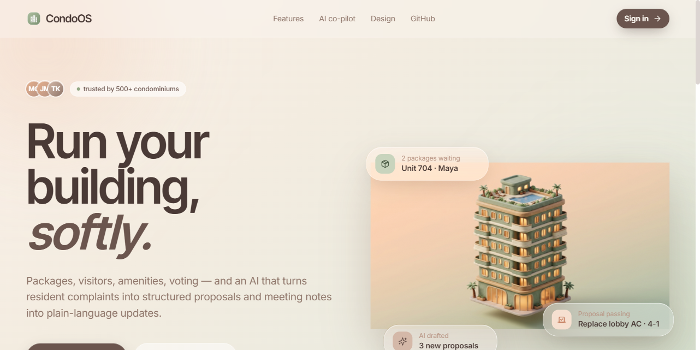
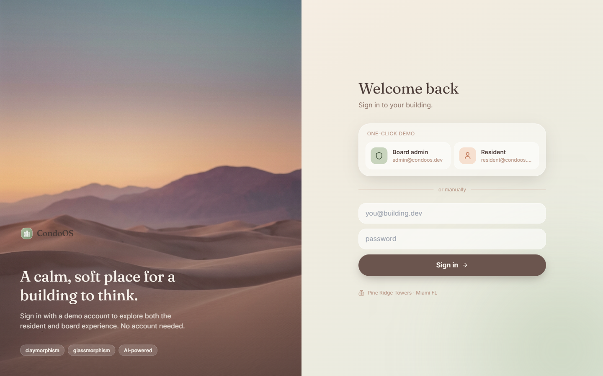
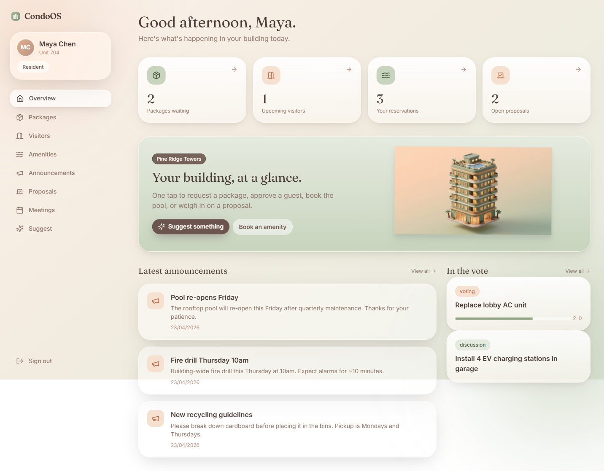
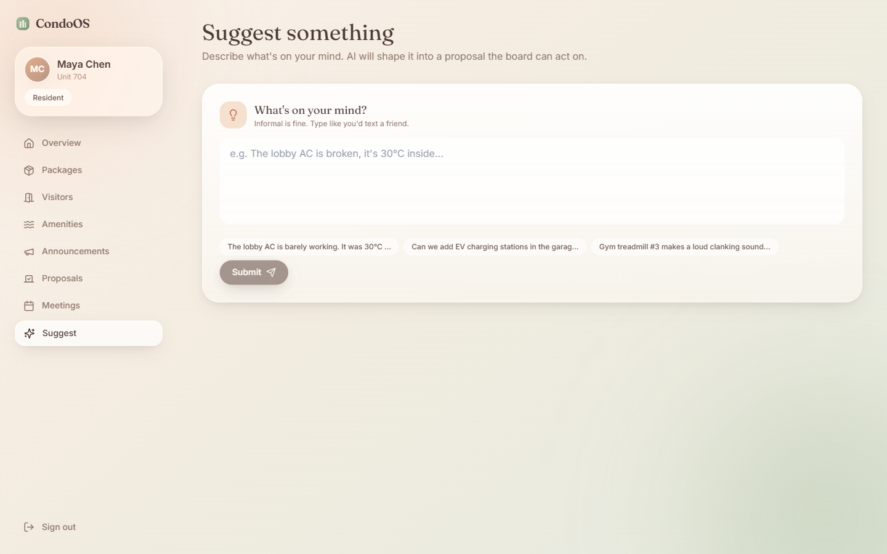
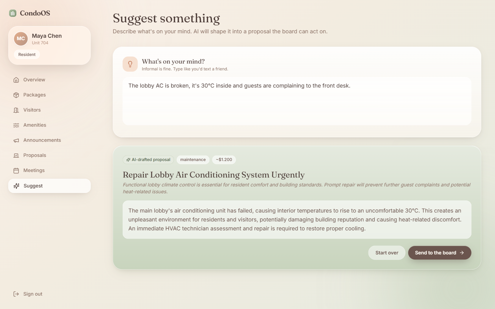
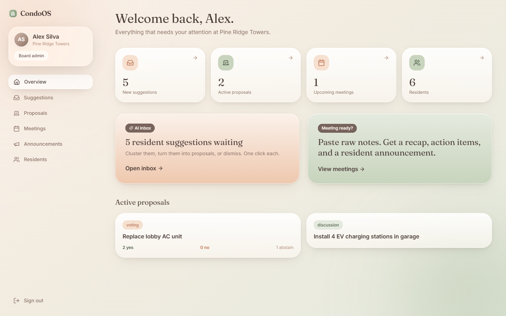
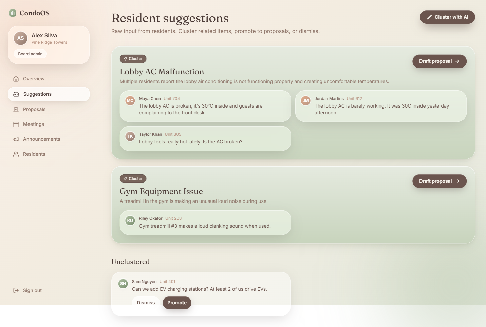

# CondoOS

**An AI-powered operating system for condominiums.** Packages, visitors, amenities, meetings, voting, suggestions, and AI-drafted proposals, summaries, and resident announcements — all in one soft, tactile interface.

**Live**: [**condoos-ten.vercel.app**](https://condoos-ten.vercel.app) · API [`condoos-api.fly.dev`](https://condoos-api.fly.dev/api/health) · design system at [`/design`](https://condoos-ten.vercel.app/design) · [GitHub](https://github.com/stefanogebara/condoos)

Sign in with one click as **admin@condoos.dev** (board) or **resident@condoos.dev** (resident). Real Claude Haiku on OpenRouter. Real SQLite on a Fly volume in `iad`.

Design language: **claymorphism + glassmorphism**. Muted sage / dusty peach / cream palette. Frosted glass cards layered over rich dusk-landscape backdrops and soft 3D clay illustrations — all generated by AI. Type set in **Inter Tight + Inter** — the modern UI pairing shared by Google Material 3 and Claude.ai. A Stitch Design System (asset `7671660702723806725`) captures the tokens so any Stitch-generated screen inherits the visual language.



---

## Clone & run (< 2 min)

```bash
git clone https://github.com/stefanogebara/condoos.git
cd condoos

# One-shot setup: copies .env, installs deps, seeds SQLite
bash scripts/setup.sh

# Run server (4000) + client (3000) together
npm run dev
```

Open `http://localhost:3000` → click **Resident** or **Board admin** on the login page.

**Heads-up on the AI features**: by default `.env` ships without an `OPENROUTER_API_KEY`, so every `/api/ai/*` endpoint returns a deterministic fallback (tagged `_fallback: true` in the JSON). To get real Claude Haiku, drop a key from [openrouter.ai](https://openrouter.ai) into `.env`:

```bash
OPENROUTER_API_KEY=sk-or-v1-...
OPENROUTER_MODEL=anthropic/claude-3.5-haiku
```

Everything else — auth, DB, voting, packages, visitors, meetings — runs without any key.

### Manual steps (if the script fails)

```bash
cp .env.example .env
npm run install:all   # install root + server + client
npm run seed          # create SQLite + seed demo data
npm run dev           # run server (4000) + client (3000) together
```

### Demo accounts

| Role        | Email                    | Password      |
| ----------- | ------------------------ | ------------- |
| Board admin | `admin@condoos.dev`      | `admin123`    |
| Resident    | `resident@condoos.dev`   | `resident123` |

Four additional residents (Jordan, Taylor, Riley, Sam) are seeded with password `resident123` for live voting/comment demos.

### Google sign-in (optional)

Set `GOOGLE_CLIENT_ID` in `.env` and on Fly (and optionally `REACT_APP_GOOGLE_CLIENT_ID` for Vercel). Create the client at [console.cloud.google.com/apis/credentials](https://console.cloud.google.com/apis/credentials) with:

- **Type**: Web application
- **Authorized JS origins**: `http://localhost:3000`, `https://condoos-ten.vercel.app`

When set, a "Continue with Google" button appears on the login page. First-time Google users auto-join the seeded condominium as residents. Without the env var the button hides silently — demo stays clean.

---

## The 5-minute demo

The golden path that shows every AI capability without switching tools.

### 1. Land → sign in as a resident



One click on the **Resident** tile signs you in as Maya Chen (Unit 704).

### 2. Resident overview



Today's packages, upcoming visitors, reservations, hot proposals, latest announcements.

### 3. Submit a suggestion → **AI moment #1**



Paste `"The lobby AC is broken, it's 30°C inside and guests are complaining."` and hit **Submit**. The AI (Claude Haiku via OpenRouter) transforms it:



> **Repair Lobby Air Conditioning System Urgently**
> maintenance · ~$1,200
> *Functional lobby climate control is essential for resident comfort...*

Click **Send to the board** → a proposal is created, the suggestion is marked as promoted.

### 4. Switch to the board



One-click login as Alex Silva (board admin) shows the AI inbox with a count of waiting suggestions.

### 5. Cluster suggestions → **AI moment #2**

Click **Cluster with AI** on the Suggestions page. The AI groups semantically related complaints:



> **Lobby AC Malfunction** — 3 residents
> **Gym Equipment Issue** — 1 resident
> Unclustered: EV charging

Each cluster has a **Draft proposal** button that runs the AI draft on the cluster's representative item.

### 6. Discussion summary → **AI moment #3**

Open a proposal in discussion (e.g. *Install 4 EV charging stations*). Click **Summarize** — the AI reads all 5 comments and returns agreements, disagreements, and open questions.

### 7. Plain-language explainer → **AI moment #4**

Click **Explain for me** on any proposal — the AI produces a 2-3 paragraph resident-friendly version, no jargon.

### 8. Run a meeting → **AI moment #5** (the big one)

Board → Meetings → Q2 Board Meeting. Paste raw notes:

```
- reviewed EV chargers proposal
- 4 residents in favor, 1 strongly against (jordan cost concern)
- decision: approve 2 chargers initially, revisit in 6 months
- lobby AC: approved replacement quote from cool breeze
- maria to coordinate install schedule with ricardo
```

Click **Summarize** → AI produces
- A clean recap
- Explicit list of decisions
- Action items (auto-persisted below and checkable)
- A **resident-friendly announcement draft**, ready to publish with one click

### 9. Close a vote → **AI moment #6**

On a `voting` proposal, click **Close & AI decision**. The AI writes a board-ready decision summary (headline, rationale, next steps) and auto-publishes it as a pinned announcement to all residents.

---

## Architecture

```
condoos/
├── server/               # Express + TypeScript + SQLite (better-sqlite3)
│   ├── src/
│   │   ├── db/           # schema.sql, index.ts, seed.ts
│   │   ├── routes/       # auth, packages, visitors, amenities,
│   │   │                 # announcements, suggestions, proposals,
│   │   │                 # meetings, users, ai
│   │   ├── ai/           # OpenRouter client, prompt library, fallbacks
│   │   ├── lib/          # JWT auth middleware, response helpers
│   │   └── server.ts
│   └── data/             # SQLite file (gitignored)
├── client-app/           # React 18 + CRA + Tailwind
│   ├── src/
│   │   ├── pages/        # Landing, Login,
│   │   │   ├── resident/ # 9 pages: Overview, Packages, Visitors,
│   │   │   │             # Amenities, Announcements, Proposals,
│   │   │   │             # ProposalDetail, Meetings, Suggest
│   │   │   └── board/    # 8 pages: Overview, Suggestions, Proposals,
│   │   │                 # ProposalDetail, Meetings, MeetingDetail,
│   │   │                 # Announcements, Residents
│   │   ├── components/   # GlassCard, Button, Badge, Avatar, Sidebar,
│   │   │                 # PageHeader, EmptyState, Logo
│   │   └── lib/          # api client, auth context
│   └── public/images/    # AI-generated hero + backgrounds + icons
├── scripts/
│   └── gen-images.sh     # Regenerate imagery via Gemini
└── docs/screenshots/
```

### Tech

- **Frontend**: React 18 + TypeScript, Tailwind (custom sage/peach/cream/dusk tokens), react-router, axios, react-hot-toast, lucide-react icons, Google Fraunces + Inter fonts
- **Backend**: Node 20 + Express 4 + TypeScript, `better-sqlite3` (zero-config, WAL mode), Zod, bcryptjs, jsonwebtoken, morgan, CORS
- **AI**: OpenRouter → `anthropic/claude-3.5-haiku`; fast, cheap, and good enough for all 6 tasks
- **Storage**: single SQLite file at `server/data/condoos.sqlite`
- **Imagery**: Gemini 3.1 Flash Image Preview (`scripts/gen-images.sh`); the hero 3D clay building, dusk/sage/dunes backgrounds, and clay icons are all AI-generated

---

## AI endpoints

| Endpoint                                      | What it does                                                                 |
| --------------------------------------------- | ---------------------------------------------------------------------------- |
| `POST /api/ai/proposal-draft`                 | Free-text suggestion → `{title, description, category, estimated_cost, rationale}` |
| `POST /api/ai/cluster-suggestions`            | All open suggestions → semantic clusters + labels                            |
| `POST /api/ai/proposals/:id/summarize-thread` | Discussion → `{summary, agreements, disagreements, open_questions}`          |
| `POST /api/ai/proposals/:id/explain`          | Plain-language resident explanation                                          |
| `POST /api/ai/proposals/:id/decision-summary` | Board decision summary (headline, outcome, rationale, next steps)            |
| `POST /api/ai/meetings/:id/summarize`         | Raw notes → summary, decisions, action items, announcement draft             |

**Graceful degradation**: every AI endpoint has a deterministic fallback (keyword clustering, template text, etc.). When `OPENROUTER_API_KEY` is missing or errors, responses are tagged with `_fallback: true` and the app keeps running — demos never hang.

---

## Data model

One condominium (multi-tenant-ready via `condominium_id`). Two roles: `resident`, `board_admin`.

Core entities:
- `users`, `condominiums`
- `packages`, `visitors`
- `amenities`, `amenity_reservations`
- `announcements` (`source`: `manual` / `ai_meeting` / `ai_decision`)
- `suggestions` + `suggestion_clusters`
- `proposals` + `proposal_comments` + `proposal_votes`
- `meetings` + `action_items`

See `server/src/db/schema.sql` for full SQL.

---

## Environment

Copy `.env.example` → `.env`:

```bash
PORT=4000
JWT_SECRET=change-me-in-prod
DB_PATH=./data/condoos.sqlite
OPENROUTER_API_KEY=sk-or-v1-...
OPENROUTER_MODEL=anthropic/claude-3.5-haiku
```

For image regeneration:
```bash
GEMINI_API_KEY=... bash scripts/gen-images.sh
```

---

## Deploy

**Client** — already live on Vercel. Redeploy with:

```bash
vercel --prod
```

**Server** — two configs ready. Pick your host.

Fly.io (recommended, persistent SQLite volume):

```bash
flyctl auth login
flyctl volumes create condoos_data --region mia --size 1
flyctl secrets set OPENROUTER_API_KEY=sk-or-v1-... JWT_SECRET=$(openssl rand -hex 32)
flyctl deploy
```

Render (one-click via blueprint):

```bash
# Push render.yaml and click "Deploy from blueprint" in the Render dashboard
# Set OPENROUTER_API_KEY manually in the service dashboard.
```

Then update `vercel.json` `rewrites` to point `/api/*` at your deployed server URL (default: `condoos-api.fly.dev`).

## What's next

- **Realtime** — Socket.io for live vote counts and new-suggestion toasts.
- **Mobile nav** — bottom-bar treatment for resident + board apps on phones.
- **Multi-tenant** — every table carries `condominium_id`; a condo picker + signup would unlock this.
- **Cron** — weekly resident digest (AI-composed) + amenity reminders.

---

## License

MIT.
