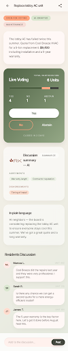

# Stitch concepts

CondoOS ships with a [Stitch](https://stitch.withgoogle.com/) design system registered as asset `7671660702723806725` and a concept project at `projects/1399691735525483036`. Any screen generated inside that Stitch project inherits the CondoOS tokens (Inter Tight + Inter, sage/peach/dusk/cream palette, ROUND_TWELVE claymorphism).

## Mobile — Proposal detail

Generated from the CondoOS prompt: "Replace lobby AC unit" proposal detail screen for mobile. Shows live voting bar, AI discussion summary, plain-language explainer, and resident discussion thread. All on-brand.

Stitch auto-wrote the project's design spec ("Tactile Concierge") — a great articulation of the philosophy that matches our own `/design` page:

- **Surface hierarchy through nesting, not borders** — background shifts define edges, no 1px lines
- **Claymorphism "Soft Lift"** — inner highlight + diffused warm shadow, no harsh drop shadows
- **Tonal authority** — warm, low-contrast palette over engagement-hacking vibrancy
- **Editorial typography** — Inter Tight 600 for display with -0.03em tracking
